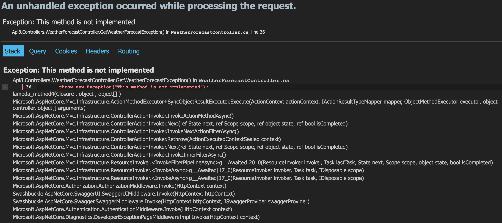

# aspnet-core8-day2

ASP.NET Core 8 開發實戰：新手上路篇

### **檢視 API 預設回傳錯誤訊息的格式，所導致的問題**
回應的內容為純文字的 HTML 內容，即使 Header 中有 `Accept: application/json`，也不會回傳 JSON 格式的錯誤訊息，這樣的結果對於前端開發者來說，是不太友善的

```bash
curl --location 'http://localhost:xxxx/WeatherForecast/exception' \
--header 'Accept: application/json'
```

錯誤內容



### **啟用 Https Middleware**

在 Program.cs 中定義 `app.UseHttpsRedirection()` 來啟用 Https Middleware，若在創建專案時未啟用除了新增 Middleware 外，還需要在 launchSettings.json 中設定 `applicationUrl` 來啟用 Https

```json
"https": {
    "commandName": "Project",
    "dotnetRunMessages": true,
    "launchBrowser": true,
    "launchUrl": "swagger",
    "applicationUrl": "https://localhost:7268;http://localhost:5010",
    "environmentVariables": {
    "ASPNETCORE_ENVIRONMENT": "Development"
    }
}
```


### **新增靜態檔案瀏覽功能**

在 Program.cs 中定義 `app.UseStaticFiles()` 來啟用靜態檔案瀏覽功能，這樣就可以直接透過瀏覽器來存取靜態檔案

靜態檔案放置於 wwwroot 資料夾中，透過瀏覽器存取 `http://localhost:xxxx/index.html` 即可存取到 wwwroot 資料夾中的 index.html 檔案


### **Razor 使用 Postman 請求 Post API 出現 400 錯誤**

ASP.NET Core Razor Pages（或 MVC）開啟了 防跨網站要求偽造（CSRF） 的防護機制時，會要求：

表單中（或請求中）帶有 __RequestVerificationToken。
同時也要帶對應的 Cookie（通常是 .AspNetCore.AntiForgery.xxxxx 開頭）。

當瀏覽器使用一般的 HTML 表單提交時，Razor 會自動幫你在 <form> 內插入這個 Token（隱藏欄位），並且瀏覽器會附帶相關 Cookie。因此在「一般使用者操作瀏覽器」的情況下，Token 與 Cookie 會自動配對，一切順利。
但在 Postman 測試時，若你沒有人為地把 Token 與 Cookie 帶上，伺服器就會判斷「CSRF 驗證失敗」，直接回傳 HTTP 400

```bash
curl --location 'http://localhost:5023/Privacy' \
--header 'Content-Type: application/x-www-form-urlencoded' \
--header 'Cookie: .AspNetCore.Antiforgery.iyZPTcKEqNY=THISISTOKEN' \
--data-urlencode '__RequestVerificationToken=THISISTOKEN'
```


### **Razor 相關規則**

透過繼承 PageModel 來實現 Razor Page 的後端邏輯，並透過 Razor Page 的檔案結構來實現前端頁面的設計，Razor Page 的後端邏輯與前端頁面設計是放在同一個檔案中，例如 `Privacy.cshtml.cs` 與 `Privacy.cshtml`，檔名為路由的一部分，例如 `Privacy.cshtml` 對應的路由為 `/Privacy`，頁面內容則為 `Privacy.cshtml` 的內容


### **ASP.NET Core 的預設路由無大小寫區分**

ASP.NET Core 的預設路由系統基於 Windows 檔案系統的大小寫不敏感性，因此路由也被設計為大小寫不敏感的。如果應用程式部署在大小寫敏感的檔案系統（例如 Linux 上的 ext4 文件系統）上，這個行為仍然是由框架本身的設定所控制，與檔案系統無關


### **Razor vs. Blazor 的選擇建議**

| **比較項目**       | **Razor**                                            | **Blazor**                                                 |
|---------------------|-----------------------------------------------------|-----------------------------------------------------------|
| **運行模式**        | 伺服器端渲染（SSR）                                   | 客戶端（WebAssembly）或伺服器模式                         |
| **互動性**          | 需要結合 JavaScript                                   | 使用 C# 實現互動性，適合 SPA 開發                         |
| **開發者友好性**    | 更適合熟悉 HTML/C# 的傳統開發者                       | 適合 .NET 全棧開發者                                      |
| **SEO 支援**        | 強，伺服器端生成完整 HTML                              | WebAssembly 的 SEO 支援較弱，Blazor Server 支援較強       |
| **性能**           | 依賴伺服器資源，適合大規模請求                        | 初次加載慢（WebAssembly），高互動性應用適合               |
| **使用場景**        | 內容為主的動態網頁                                    | 互動性強的前端應用或單頁應用                              |
| **技術限制**        | 缺乏前端互動能力，需額外依賴 JS                       | WebAssembly 加載慢，伺服器模式依賴 SignalR                |


### **Blazor 的模式**
1. **Blazor Server**
   - 應用程式邏輯執行在伺服器上，透過 SignalR 即時同步到客戶端。
   - 適合需要即時更新、對 SEO 友好並且延遲要求不高的應用。

2. **Blazor WebAssembly (WASM)**
   - 應用程式邏輯執行在客戶端（瀏覽器端），以 WebAssembly 運行 .NET 程式。
   - 適合對互動性能要求高、能減少伺服器依賴的應用。

3. **Auto 模式**
   - **自動選擇模式**：應用程式會根據執行環境或用戶端條件動態選擇 Blazor Server 或 Blazor WebAssembly 模式運行。

```csharp
// Auto          - 下載 WebAssembly 資產時使用伺服器，然後使用 WebAssembly
// None          - 沒有互動功能 (只有靜態伺服器轉譯)
// Server        - 在伺服器上執行
// WebAssembly   - 使用 WebAssembly 在瀏覽器中執行
dotnet new blazor -n Blazor8 --interactivity Server
```


### **Blazor Server 元件傳遞機制**
1. **父元件向子元件傳遞參數**
   - 在子元件中定義參數，並在父元件中使用子元件時，透過 `@` 符號來傳遞參數
2. **子元件向父元件傳遞事件**
   - 在子元件中定義事件，並在父元件中使用子元件時，透過 `EventCallback` 來傳遞事件